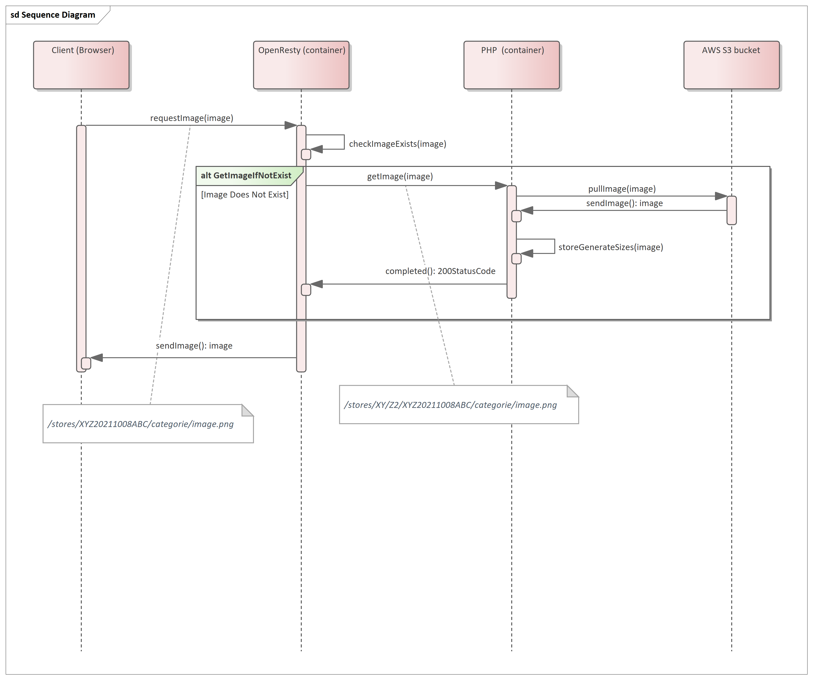

# Challenge 1 : Save our Media layer from folders overflow

<details>
<summary>Click to check the challenge details</summary>

## Challnge-1 details

### Context
The Media layer (called cdn - even it's not a real cdn) is composed by an app that generates and serves multiple sizes on the fly.
In first request, the app fetch the original media, generates 3 sizes (sm, md, lg), and stores them in order to serve them directly from the disk in the future.     

### Problematic
It's common that linux folders have a limit of sub-folder they can hold. 
Our internal app can save files under a custom path, but we need a custom vhost that can serve those files from that custom path.

### Expected resolution
Using ansible and docker-compose, pop-up 2 containers distributed as following:

1. 1 x Openresty container (this will contain your resolution)
2. 1 x PHP container that hosts your sample.

***Resolution example*** 

A request can ask to serve a file under the following path: `/stores/XYZ20211008ABC/categorie/image.png`

we need a vhost that can reformulate this request to the following: `/stores/XY/Z2/XYZ20211008ABC/categorie/image.png`

### Hints
Nginx doesn't support lua scripting so you can manipulate the coming request as you want, here we can introduce - lua scripting - a scripting module that is added in top of nginx to allow customized scripting.

<br />

[👉 more details](https://github.com/youcan-shop/coding-challenges/blob/master/DevOps%20Engineer/README.md#coding-challenge-i-save-our-media-layer-from-folders-overflow)

</details>

---

## Requirements : 

* having docker and docker compose installed and the current user can use them.
* having ansible installed.
* having python3.
* have sudo priviliges.


## Notes

* Supported images types : jpeg/jpg, png, bmp
* In ansible, there is a [`become: true`](challenge-1\ansible\main.yaml), which is needed to install pip3, you can check that out by [👉clicking here](challenge-1\ansible\roles\install_packages\tasks\main.yaml).

## Usage

* Run ansible script : `sudo ansible-playbook ansible/main.yaml`. 
* set domain name on Hosts file (127.0.0.1 example.com) 
* available images that you can use to test, on the AWS bucket are : 

```
abc-store/image.jpg
azx-store/image.png
store-1/image.jpg
store-2/image.jpg
```

So the links you'll be using will look like this (respectively, and after adding size suffixes [-sm, -md, -lg] ) :

```
http://example.com/stores/abc-store/categorie/image-lg.jpg 
http://example.com/stores/azx-store/categorie/image-md.png 
http://example.com/stores/store-1/categorie/image-sm.jpg 
http://example.com/stores/store-2/categorie/image-lg.jpg 
```


    💡 The images on the S3 bucket are just put in a way to make it work, and to focus on the "CDN" part, it can be always done in another way.

## How does it work 

<p align="center">

</p>

* The client sends a request to the openResty "CDN" (or reverse proxy ??) respecting the requested format `example.com/stores/XYZ20211008ABC/categorie/image-sm.png`

* Using a Lua script i check if the image exists, if it is not, i sent an HTTP GET request to the `php-app` which will get the original uploaded image `stores/XYZ20211008ABC/categorie/image.png`, make diffrent sizes out of it. Then it stores the three sizes in a mounted directory `/stores`, and finally sends a 200-OK status code back to the Lua script.

* The same directory `/stores` is also mounted to the OpenResty contaier, the lua script returns the image back to the client.

* That's it 🦆


?>
